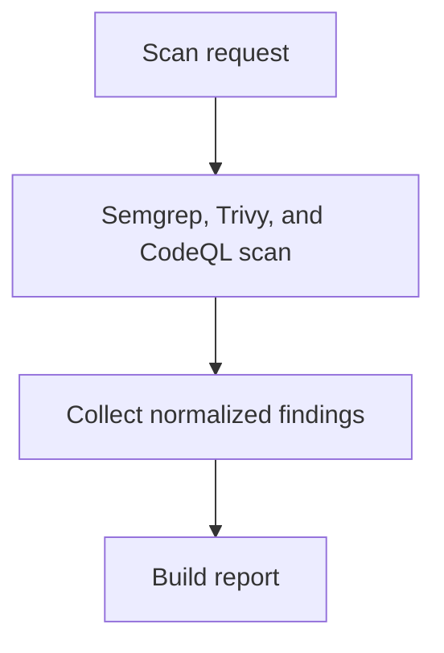

# defAPI

defAPI는 로컬 코드 또는 디렉터리를 보안 스캐너로 분석하고 정규화된 보고서를 반환하는 FastAPI 기반 보안 스캔 MVP입니다.

현재 파이프라인은 다음과 같습니다.

```text
사용자 코드
  -> MCP 스캐너 분석(Semgrep, Trivy, CodeQL)
  -> Finding 정규화
  -> 보안 보고서 생성
  -> 결과 반환
```

## 워크플로우 개요



원본 프로젝트 파일은 변경하지 않습니다. defAPI는 현재 패치 생성, 자동 교정, sandbox 적용, 재스캔 검증을 수행하지 않습니다.

## 현재 구현 상태

구현됨:

- FastAPI `/health`, `/scan`, `/report/{scan_id}` API
- FastMCP 기반 MCP server tools
- LangGraph 기반 scan -> report workflow
- Semgrep, Trivy, CodeQL MCP wrapper
- Scanner output을 공통 `Finding` 모델로 정규화
- 스캐너 실행 결과와 severity count 기반 summary 생성
- LoRA/SFT, DPO 학습 모듈 skeleton

아직 제한적인 부분:

- 테스트 러너 연동은 아직 없습니다.
- fine-tuned/DPO 모델 inference는 아직 API workflow에 연결되어 있지 않습니다.

## 프로젝트 구조

```text
defapi/
  api.py                  # FastAPI endpoint
  models.py               # Pydantic domain/API model
  workflow.py             # scan/report pipeline
  reports.py              # report 생성
  mcp/
    scanners.py           # Semgrep, Trivy, CodeQL CLI wrapper/parser
    server.py             # FastMCP tool server
  training/
    defapi_qwen2_5_coder_14b_lora.ipynb  # RunPod A100 LoRA 학습 노트북
```

## 설치

Python 3.12 기준으로 확인했습니다.

```bash
python -m venv .venv
source .venv/bin/activate
python -m pip install --upgrade pip
pip install -r requirements.txt
```

주의: `requirements.txt`에는 API 실행용 패키지와 기존 학습용 패키지가 함께 들어 있습니다. RunPod Jupyter에서 LoRA 학습을 실행할 때는 버전 충돌을 피하기 위해 아래의 RunPod 전용 잠금 파일을 우선 사용하세요.

RunPod CUDA 12.4 Jupyter 학습 환경:

```bash
pip install --upgrade --no-cache-dir -r requirements-runpod-cu124.txt
```

이 파일은 `torch==2.5.1+cu124`, `transformers==4.46.3`, `peft==0.13.2` 조합으로 고정되어 있습니다. 학습은 A100 80GB에서 bf16 LoRA로 실행하는 것을 기준으로 합니다. Mac/CPU에서는 대형 모델 학습이 정상 동작하지 않을 수 있습니다.

## 보안 스캐너 설치

Semgrep:

```bash
pip install semgrep
```

Trivy macOS:

```bash
brew install trivy
```

Trivy Linux:

```bash
curl -sfL https://raw.githubusercontent.com/aquasecurity/trivy/main/contrib/install.sh | sh -s -- -b /usr/local/bin
```

CodeQL CLI:

```bash
brew install codeql
```

설치 확인:

```bash
semgrep --version
trivy --version
codeql --version
```

## 실행

API 서버 실행:

```bash
uvicorn defapi.api:app --host 127.0.0.1 --port 8000 --reload
```

헬스 체크:

```bash
curl http://127.0.0.1:8000/health
```

응답:

```json
{"status":"ok"}
```

웹 프론트엔드 개발 서버 실행:

```bash
cd frontend
npm install
npm run dev
```

Vite 개발 서버는 `/api` 요청을 `http://localhost:8000`의 FastAPI 서버로 프록시합니다.

프론트엔드를 FastAPI에서 함께 서빙하려면 빌드 후 API 서버를 실행합니다.

```bash
cd frontend
npm install
npm run build
cd ..
uvicorn defapi.api:app --host 127.0.0.1 --port 8000
```

이 경우 `http://127.0.0.1:8000`에서 빌드된 웹 앱이 열리고, `/api/*` 요청은 같은 FastAPI 앱이 처리합니다.

스캔 요청:

```bash
curl -X POST http://127.0.0.1:8000/scan \
  -H "Content-Type: application/json" \
  -d '{
    "target": "/path/to/local/project"
  }'
```

응답:

```json
{
  "scan_id": "generated-id",
  "status": "completed"
}
```

보고서 조회:

```bash
curl http://127.0.0.1:8000/report/{scan_id}
```

보고서에는 다음 정보가 들어갑니다.

- scanner 실행 결과
- normalized finding 목록
- summary count

## FastMCP 서버 실행

MCP 클라이언트에서 defAPI 스캐너를 tool로 쓰려면 FastMCP 서버를 실행합니다.

```bash
python -m defapi.mcp.server
```

등록된 tool:

- `list_scanners`: 사용 가능한 scanner 이름 반환
- `scanner_health`: Semgrep, Trivy, CodeQL CLI 설치 경로 확인
- `scan_with_scanner`: 특정 scanner 하나만 실행
- `scan_project`: Semgrep, Trivy, CodeQL 전체 workflow 실행

## Docker 실행

Docker build:

```bash
docker build -t defapi .
```

Docker 실행:

```bash
docker run --rm -p 8000:8000 defapi
```

다른 터미널에서 확인:

```bash
curl http://127.0.0.1:8000/health
```

## LoRA 학습 실행

Qwen/Qwen2.5-Coder-14B-Instruct fine-tuning은 RunPod A100 80GB Jupyter에서 bf16 LoRA로 실행하는 것을 기준으로 합니다.

RunPod Jupyter에서는 `defapi/training/defapi_qwen2_5_coder_14b_lora.ipynb`를 열고 fresh kernel에서 위에서부터 실행하면 됩니다. 첫 번째 코드 셀이 `requirements-runpod-cu124.txt`의 잠긴 패키지 버전을 확인하고, `torch` import 전에 필요한 패키지를 설치합니다.

노트북은 RunPod 업로드 편의를 위해 SFT 전처리와 assistant-only label masking helper를 내부 셀에 포함합니다. 따라서 repo 전체가 아니라 `.ipynb`와 requirements 파일만 업로드해도 학습 셀이 실행됩니다.

기본 설정은 전체 `train` split, `max_seq_length: 2048`, `/workspace/checkpoints/defapi-qwen2.5-coder-14b-lora` 저장 경로를 기준으로 합니다. RunPod RTX A6000에서도 버티기 쉽도록 FlashAttention 대신 `attn_implementation: sdpa`, `gradient_checkpointing: true`, W&B disabled(`report_to: none`)가 기본입니다. dtype은 GPU가 bf16을 지원하면 bf16, 아니면 fp16으로 자동 선택합니다. 데이터셋은 Hugging Face의 `hitoshura25/crossvul`을 사용합니다.

`hitoshura25/crossvul`은 `cwe_id`, `cwe_description`, `language`, `vulnerable_code`, `fixed_code` 컬럼을 사용합니다. 학습 로더는 이를 chat SFT 형식으로 변환합니다.

- user message: 취약 코드와 "수정하고 짧게 설명하라"는 요청만 포함
- assistant message: 수정 코드 block과 짧은 설명만 포함
- `CWE:`, `Description:`, `Language:`, `Vulnerable code:` 같은 원본 데이터셋 필드 라벨은 assistant target에 넣지 않음

토큰화 후 `labels`는 assistant 응답 토큰에만 남기고 system/user prompt 토큰은 `-100`으로 mask합니다. 노트북의 tokenizer 셀은 재학습 전에 샘플 5개를 디코딩해 실제 loss target을 출력하고, prompt field label이 target에 섞이면 실패하도록 검사합니다.

CrossVul은 기본적으로 `train` split만 사용하므로 로더가 `eval_split_size: 0.1`, `seed: 42`로 train/eval을 자동 분리합니다. 별도 eval split이 있는 데이터셋은 `--eval-dataset-split`으로 지정할 수 있습니다.

다른 Hugging Face dataset을 쓰려면 노트북의 `CONFIG["dataset_name"]`, `CONFIG["dataset_split"]`, `CONFIG["eval_split"]` 값을 수정하세요.

로컬 JSONL을 쓰려면 노트북의 dataset load cell을 로컬 파일 로더로 바꾸면 됩니다. JSONL은 각 줄에 `instruction`, `input`, `output` 필드를 두거나 CrossVul과 같은 `cwe_id`, `cwe_description`, `language`, `vulnerable_code`, `fixed_code` 필드를 둘 수 있습니다.

W&B 없이 실행하려면 노트북 `CONFIG["report_to"]`를 `none`으로 바꾸세요. W&B를 사용할 때는 기본값인 `CONFIG["report_to"] = "wandb"`를 유지하고 로그인 셀을 실행하면 됩니다.

## Base model / Fine-tuned LoRA 비교

재학습 후 평가는 하나만 실행합니다. SGLang 연결과 모델명은 `.env`의 `SGLANG_*` 값을 사용하고, 결과는 LangSmith에 기록합니다.

```bash
python eval/eval.py
```

필요한 환경 변수:

```bash
LANGSMITH_API_KEY=...
```

비교 대상:

- base: `Qwen/Qwen2.5-Coder-14B-Instruct`
- fine-tuned: `Qwen/Qwen2.5-Coder-14B-Instruct:defapi`

평가 케이스:

- command injection
- SQL injection
- `eval(user_input)`
- hardcoded secret
- path traversal

비교 기준:

- 수정 코드 block이 있는지
- 취약점별 핵심 단어가 들어갔는지
- `CWE:`, `Description:`, `Vulnerable code:` 같은 데이터셋 필드를 그대로 출력하지 않는지

실행하면 LangSmith에 세 개의 experiment가 만들어집니다.

- `{timestamp}-base`
- `{timestamp}-lora`
- `{timestamp}-base-vs-lora`

로컬에는 experiment 이름만 `eval/results/{timestamp}_langsmith_eval.json`에 저장합니다.

## 검증 명령

문법/import 확인:

```bash
python -m compileall -q defapi
```

테스트 파일이 있을 때:

```bash
python -m pytest -q
```

현재 테스트 디렉터리가 없으면 pytest가 `No files were found in testpaths`로 종료할 수 있습니다.

## API 요약

### `GET /health`

서버 상태 확인.

### `POST /scan`

로컬 파일 또는 디렉터리를 스캔합니다.

요청:

```json
{
  "target": "/path/to/local/project"
}
```

### `GET /report/{scan_id}`

스캔 결과 보고서를 조회합니다.

## 안전 원칙

- 원본 프로젝트 파일을 변경하지 않습니다.
- 패치 생성이나 자동 교정은 수행하지 않습니다.
- 스캔 대상 경로는 로컬에 존재해야 합니다.

## 빠른 문제 해결

### `semgrep executable is not installed`

```bash
pip install semgrep
```

### `trivy executable is not installed`

macOS:

```bash
brew install trivy
```

Linux:

```bash
curl -sfL https://raw.githubusercontent.com/aquasecurity/trivy/main/contrib/install.sh | sh -s -- -b /usr/local/bin
```

### 포트 8000이 이미 사용 중

```bash
uvicorn defapi.api:app --host 127.0.0.1 --port 8001 --reload
```
