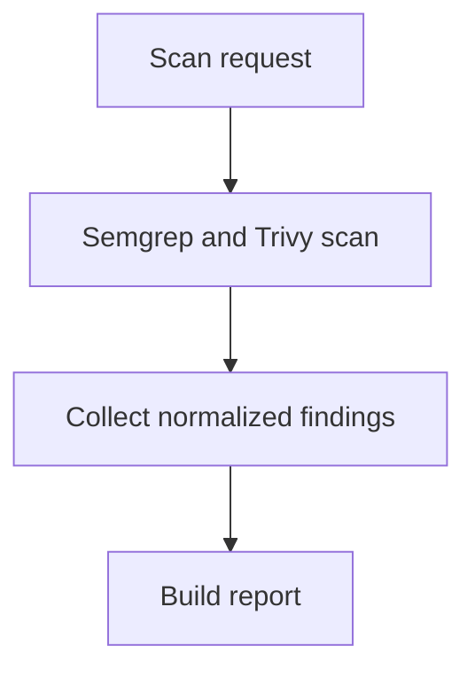

# defAPI

defAPI는 로컬 코드 또는 디렉터리를 보안 스캐너로 분석하고 정규화된 보고서를 반환하는 FastAPI 기반 보안 스캔 MVP입니다.

현재 파이프라인은 다음과 같습니다.

```text
사용자 코드
  -> MCP 스캐너 분석(Semgrep, Trivy)
  -> Finding 정규화
  -> 보안 보고서 생성
  -> 결과 반환
```

## 워크플로우 개요



원본 프로젝트 파일은 변경하지 않습니다. defAPI는 현재 패치 생성, 자동 교정, sandbox 적용, 재스캔 검증을 수행하지 않습니다.

## 현재 구현 상태

구현됨:

- FastAPI `/health`, `/scan`, `/report/{scan_id}` API
- LangGraph 기반 scan -> report workflow
- Semgrep, Trivy MCP wrapper
- Scanner output을 공통 `Finding` 모델로 정규화
- 스캐너 실행 결과와 severity count 기반 summary 생성
- LoRA/SFT, DPO 학습 모듈 skeleton

아직 제한적인 부분:

- 테스트 러너 연동은 아직 없습니다.
- fine-tuned/DPO 모델 inference는 아직 API workflow에 연결되어 있지 않습니다.

## 프로젝트 구조

```text
defapi/
  api.py                  # FastAPI endpoint
  models.py               # Pydantic domain/API model
  workflow.py             # scan/report pipeline
  reports.py              # report 생성
  mcp/
    base.py               # 공통 command scanner wrapper
    semgrep.py            # Semgrep JSON parser
    trivy.py              # Trivy JSON parser
  training/
    defapi_qwen2_5_coder_14b_lora.ipynb  # RunPod A100 LoRA 학습 노트북
```

## 설치

Python 3.12 기준으로 확인했습니다.

```bash
python -m venv .venv
source .venv/bin/activate
python -m pip install --upgrade pip
pip install -r requirements.txt
```

주의: `requirements.txt`에는 API 실행용 패키지와 기존 학습용 패키지가 함께 들어 있습니다. RunPod Jupyter에서 LoRA 학습을 실행할 때는 버전 충돌을 피하기 위해 아래의 RunPod 전용 잠금 파일을 우선 사용하세요.

RunPod CUDA 12.4 Jupyter 학습 환경:

```bash
pip install --upgrade --no-cache-dir -r requirements-runpod-cu124.txt
```

이 파일은 `torch==2.5.1+cu124`, `transformers==4.46.3`, `peft==0.13.2` 조합으로 고정되어 있습니다. 학습은 A100 80GB에서 bf16 LoRA로 실행하는 것을 기준으로 합니다. Mac/CPU에서는 대형 모델 학습이 정상 동작하지 않을 수 있습니다.

## 보안 스캐너 설치

Semgrep:

```bash
pip install semgrep
```

Trivy macOS:

```bash
brew install trivy
```

Trivy Linux:

```bash
curl -sfL https://raw.githubusercontent.com/aquasecurity/trivy/main/contrib/install.sh | sh -s -- -b /usr/local/bin
```

설치 확인:

```bash
semgrep --version
trivy --version
```

## 실행

API 서버 실행:

```bash
uvicorn defapi.api:app --host 127.0.0.1 --port 8000 --reload
```

헬스 체크:

```bash
curl http://127.0.0.1:8000/health
```

응답:

```json
{"status":"ok"}
```

스캔 요청:

```bash
curl -X POST http://127.0.0.1:8000/scan \
  -H "Content-Type: application/json" \
  -d '{
    "target": "/path/to/local/project"
  }'
```

응답:

```json
{
  "scan_id": "generated-id",
  "status": "completed"
}
```

보고서 조회:

```bash
curl http://127.0.0.1:8000/report/{scan_id}
```

보고서에는 다음 정보가 들어갑니다.

- scanner 실행 결과
- normalized finding 목록
- summary count

## Docker 실행

Docker build:

```bash
docker build -t defapi .
```

Docker 실행:

```bash
docker run --rm -p 8000:8000 defapi
```

다른 터미널에서 확인:

```bash
curl http://127.0.0.1:8000/health
```

## LoRA 학습 실행

Qwen/Qwen2.5-Coder-14B-Instruct fine-tuning은 RunPod A100 80GB Jupyter에서 bf16 LoRA로 실행하는 것을 기준으로 합니다.

RunPod Jupyter에서는 `defapi/training/defapi_qwen2_5_coder_14b_lora.ipynb`를 열고 fresh kernel에서 위에서부터 실행하면 됩니다. 첫 번째 코드 셀이 `requirements-runpod-cu124.txt`의 잠긴 패키지 버전을 확인하고, `torch` import 전에 필요한 패키지를 설치합니다.

기본 설정은 `configs/defapi_qwen2_5_coder_14b_lora.yaml`와 동일하게 전체 `train` split, `max_seq_length: 2048`, W&B enabled, `/workspace/checkpoints/defapi-qwen2.5-coder-14b-lora` 저장 경로를 기준으로 합니다. VRAM 여유를 쓰기 위해 FlashAttention 대신 `attn_implementation: sdpa`를 사용하고 `gradient_checkpointing: false`로 둡니다. 데이터셋은 Hugging Face의 `hitoshura25/crossvul`을 사용합니다.

`hitoshura25/crossvul`은 `cwe_id`, `cwe_description`, `language`, `vulnerable_code`, `fixed_code` 컬럼을 사용합니다. 학습 로더가 이를 DefAPI의 `instruction`, `input`, `output` 형식으로 변환합니다.

CrossVul은 기본적으로 `train` split만 사용하므로 로더가 `eval_split_size: 0.1`, `seed: 42`로 train/eval을 자동 분리합니다. 별도 eval split이 있는 데이터셋은 `--eval-dataset-split`으로 지정할 수 있습니다.

다른 Hugging Face dataset을 쓰려면 노트북의 `CONFIG["dataset_name"]`, `CONFIG["dataset_split"]`, `CONFIG["eval_split"]` 값을 수정하세요.

로컬 JSONL을 쓰려면 노트북의 dataset load cell을 로컬 파일 로더로 바꾸면 됩니다. JSONL은 각 줄에 `instruction`, `input`, `output` 필드가 있어야 합니다.

W&B 없이 실행하려면 노트북 `CONFIG["report_to"]`를 `none`으로 바꾸세요. W&B를 사용할 때는 기본값인 `CONFIG["report_to"] = "wandb"`를 유지하고 로그인 셀을 실행하면 됩니다.

## Phoenix LLM judge eval

`eval/eval.py`는 `eval/cases/scan_cases.jsonl`의 fixture를 Phoenix dataset으로 업로드한 뒤 experiment를 실행합니다. 각 case는 defAPI `ScanWorkflow`를 직접 호출하고, 결과를 Phoenix evaluator 3개로 평가합니다.

## 로컬 Baseline / 개선 실험 / 실패 분석

Phoenix 없이 로컬에서 baseline과 개선 실험을 비교하려면 `eval/local_eval.py`를 사용합니다.

baseline 실행:

```bash
python eval/local_eval.py --run-label baseline
```

개선 실험 실행(기존 baseline과 비교):

```bash
python eval/local_eval.py \
  --run-label improved_v1 \
  --compare-to eval/results/baseline.json
```

출력물:

- `eval/results/{run_label}.json`: 케이스별 pass/fail, 이유, 스캔 요약
- `eval/results/{run_label}_failures.md`: 실패 케이스 원인 리포트
- `eval/results/{run_label}_vs_{baseline_label}.json`: baseline 대비 개선/회귀 케이스

Evaluator:

- `finding_count_bounds`: finding 개수가 case의 `min_findings_total`, `max_findings_total` 범위 안에 있는지 확인합니다.
- `expected_scanners_completed`: case가 요구한 scanner가 정상 완료됐는지 확인합니다.
- `llm_report_quality`: OpenAI model을 LLM judge로 사용해 finding이 fixture 설명과 실제로 관련 있는지 판정합니다.

Scanner 역할:

- `semgrep`: Python source code의 command injection, SQL injection, hardcoded secret 같은 코드 패턴을 탐지합니다.
- `trivy`: `requirements.txt` 같은 dependency manifest에서 CVE가 있는 오래된 패키지를 탐지합니다.

현재 eval case:

| case | 기대 |
| --- | --- |
| `clean_python_project` | intentional vulnerability가 없으므로 finding 0개 |
| `semgrep_hardcoded_secret` | 최소 finding 1개 |
| `semgrep_command_injection` | 최소 finding 1개 |
| `semgrep_sql_injection` | 최소 finding 1개 |
| `trivy_vulnerable_requirements` | 최소 finding 1개 |

Phoenix Cloud 설정:

```bash
export PHOENIX_BASE_URL="https://app.phoenix.arize.com/s/wkdwnsals0413"
export PHOENIX_API_KEY="your-phoenix-api-key"
export OPENAI_API_KEY="your-openai-api-key"
```

패키지 설치:

```bash
python -m pip uninstall -y phoenix
python -m pip install arize-phoenix-client arize-phoenix-evals openai
```

주의: PyPI의 `phoenix` 패키지는 Arize Phoenix가 아닙니다. 설치되어 있으면 `SyntaxError: multiple exception types must be parenthesized`가 날 수 있으므로 제거해야 합니다.

실행:

```bash
python eval/eval.py
```

LLM 호출 없이 연결과 스캔 러너만 먼저 확인:

```bash
python eval/eval.py --no-llm-judge --dry-run 1
```

기본 judge model은 `gpt-4o-mini`입니다. 바꾸려면 다음처럼 지정합니다.

```bash
python eval/eval.py --judge-model gpt-4o
```

실행이 성공하면 Phoenix가 dataset/experiment URL을 출력합니다.

예시:

```text
View dataset experiments: https://app.phoenix.arize.com/s/wkdwnsals0413/datasets/.../experiments
View this experiment: https://app.phoenix.arize.com/s/wkdwnsals0413/datasets/.../compare?experimentId=...
Experiment completed: 5 task runs, 3 evaluator runs, 15 evaluations
```

최근 실행 결과 요약:

| case | finding count | deterministic result | LLM judge |
| --- | ---: | --- | --- |
| `trivy_vulnerable_requirements` | 53 | pass | PASS |
| `semgrep_sql_injection` | 4 | pass | PASS |
| `semgrep_command_injection` | 3 | pass | PASS |
| `semgrep_hardcoded_secret` | 2 | pass | PASS |
| `clean_python_project` | 2 | fail | FAIL |

`clean_python_project` 실패 원인:

`clean_python_project`는 source code에 intentional vulnerability가 없는 false-positive baseline입니다. 하지만 현재 workflow는 case별 scanner 선택 없이 Semgrep과 Trivy를 모두 실행합니다. Semgrep은 코드 취약점을 찾지 않았지만, Trivy가 fixture의 `requirements.txt`에서 `requests` 관련 dependency CVE 2개를 찾았습니다.

즉, LLM judge가 clean project를 못 찾은 이유는 judge 문제가 아니라 eval 기준과 scanner 범위가 어긋났기 때문입니다. `clean_python_project`의 기대값은 "코드 취약점 0개"인데, 실제 report에는 "dependency 취약점 2개"가 포함됐습니다.

실제 finding:

- `CVE-2024-47081`: Requests URL parsing issue
- `CVE-2026-25645`: Requests predictable temporary file creation issue

이 때문에 `finding_count_bounds`는 `findings_total=2, expected=0..0`으로 fail을 냈고, LLM judge도 "clean case인데 finding이 있으므로 FAIL"로 판정했습니다.

해결 방향:

- `clean_python_project/requirements.txt`의 dependency를 Trivy가 CVE로 잡지 않는 최신 버전으로 올립니다.
- 또는 clean baseline에서는 Trivy를 제외하고 Semgrep만 실행하도록 eval case에 scanner 선택 옵션을 추가합니다.
- 또는 평가 기준을 `source_findings_total`과 `dependency_findings_total`로 분리해서 clean source code와 vulnerable dependency를 따로 봅니다.

## 검증 명령

문법/import 확인:

```bash
python -m compileall -q defapi
```

테스트 파일이 있을 때:

```bash
python -m pytest -q
```

현재 테스트 디렉터리가 없으면 pytest가 `No files were found in testpaths`로 종료할 수 있습니다.

## API 요약

### `GET /health`

서버 상태 확인.

### `POST /scan`

로컬 파일 또는 디렉터리를 스캔합니다.

요청:

```json
{
  "target": "/path/to/local/project"
}
```

### `GET /report/{scan_id}`

스캔 결과 보고서를 조회합니다.

## 안전 원칙

- 원본 프로젝트 파일을 변경하지 않습니다.
- 패치 생성이나 자동 교정은 수행하지 않습니다.
- 스캔 대상 경로는 로컬에 존재해야 합니다.

## 빠른 문제 해결

### `semgrep executable is not installed`

```bash
pip install semgrep
```

### `trivy executable is not installed`

macOS:

```bash
brew install trivy
```

Linux:

```bash
curl -sfL https://raw.githubusercontent.com/aquasecurity/trivy/main/contrib/install.sh | sh -s -- -b /usr/local/bin
```

### 포트 8000이 이미 사용 중

```bash
uvicorn defapi.api:app --host 127.0.0.1 --port 8001 --reload
```
