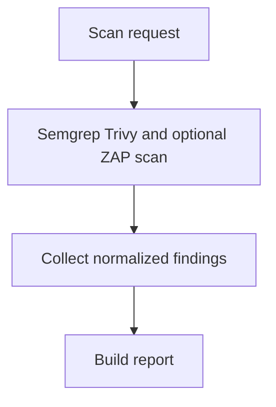

# defAPI

defAPI는 로컬 코드 또는 디렉터리를 보안 스캐너로 분석하고 정규화된 보고서를 반환하는 FastAPI 기반 보안 스캔 MVP입니다.

현재 파이프라인은 다음과 같습니다.

```text
사용자 코드
  -> MCP 스캐너 분석(Semgrep, Trivy, ZAP placeholder)
  -> Finding 정규화
  -> 보안 보고서 생성
  -> 결과 반환
```

## 워크플로우 개요



원본 프로젝트 파일은 변경하지 않습니다. defAPI는 현재 패치 생성, 자동 교정, sandbox 적용, 재스캔 검증을 수행하지 않습니다.

## 현재 구현 상태

구현됨:

- FastAPI `/health`, `/scan`, `/report/{scan_id}` API
- LangGraph 기반 scan -> report workflow
- Semgrep, Trivy, ZAP MCP wrapper
- Scanner output을 공통 `Finding` 모델로 정규화
- 스캐너 실행 결과와 severity count 기반 summary 생성
- LoRA/SFT, DPO 학습 모듈 skeleton

아직 제한적인 부분:

- ZAP은 현재 placeholder이며 기본적으로 skipped 처리됩니다.
- 테스트 러너 연동은 아직 없습니다.
- fine-tuned/DPO 모델 inference는 아직 API workflow에 연결되어 있지 않습니다.

## 프로젝트 구조

```text
defapi/
  api.py                  # FastAPI endpoint
  models.py               # Pydantic domain/API model
  workflow.py             # scan/report pipeline
  reports.py              # report 생성
  mcp/
    base.py               # 공통 command scanner wrapper
    semgrep.py            # Semgrep JSON parser
    trivy.py              # Trivy JSON parser
    zap.py                # ZAP placeholder
  training/
    config.py             # fine-tuning 설정
    lora.py               # AdaLoRA/SFT trainer factory
    dpo.py                # DPO trainer factory
    common.py             # training 공통 유틸

scripts/
  train.py                # 학습 entrypoint
```

## 설치

Python 3.12 기준으로 확인했습니다.

```bash
python -m venv .venv
source .venv/bin/activate
python -m pip install --upgrade pip
pip install -r requirements.txt
```

주의: `requirements.txt`에는 `torch`, `transformers`, `peft`, `trl`, `bitsandbytes` 같은 학습용 패키지도 포함되어 있습니다. 4bit 학습은 단일 NVIDIA GPU/CUDA 환경을 기준으로 합니다. Mac/CPU에서는 `bitsandbytes`나 대형 모델 학습이 정상 동작하지 않을 수 있습니다.

## 보안 스캐너 설치

Semgrep:

```bash
pip install semgrep
```

Trivy macOS:

```bash
brew install trivy
```

Trivy Linux:

```bash
curl -sfL https://raw.githubusercontent.com/aquasecurity/trivy/main/contrib/install.sh | sh -s -- -b /usr/local/bin
```

설치 확인:

```bash
semgrep --version
trivy --version
```

ZAP은 현재 MVP에서 placeholder입니다. `include_zap=true`로 요청하면 skipped 결과가 포함될 수 있습니다.

## 실행

API 서버 실행:

```bash
uvicorn defapi.api:app --host 127.0.0.1 --port 8000 --reload
```

헬스 체크:

```bash
curl http://127.0.0.1:8000/health
```

응답:

```json
{"status":"ok"}
```

스캔 요청:

```bash
curl -X POST http://127.0.0.1:8000/scan \
  -H "Content-Type: application/json" \
  -d '{
    "target": "/path/to/local/project",
    "include_zap": false
  }'
```

응답:

```json
{
  "scan_id": "generated-id",
  "status": "completed"
}
```

보고서 조회:

```bash
curl http://127.0.0.1:8000/report/{scan_id}
```

보고서에는 다음 정보가 들어갑니다.

- scanner 실행 결과
- normalized finding 목록
- summary count

## Docker 실행

Docker build:

```bash
docker build -t defapi .
```

Docker 실행:

```bash
docker run --rm -p 8000:8000 defapi
```

다른 터미널에서 확인:

```bash
curl http://127.0.0.1:8000/health
```

## 학습 실행

SFT/LoRA 학습 데이터는 JSONL 형식이며 각 줄에 `prompt`, `completion` 필드가 있어야 합니다.

예시:

```jsonl
{"prompt":"Analyze this vulnerable code:\n...", "completion":"Finding summary..."}
```

기본 실행:

```bash
python scripts/train.py \
  --train-path dataset/ft_data.jsonl \
  --test-path dataset/test_data.jsonl \
  --output-dir results \
  --new-model deepseek-coder-1.3b-instruct-adalora-gbsw \
  --batch-size 1 \
  --grad-accum 2 \
  --max-seq-length 1024 \
  --epochs 1
```

W&B 없이 실행:

```bash
python scripts/train.py \
  --train-path dataset/ft_data.jsonl \
  --test-path dataset/test_data.jsonl \
  --report-to none
```

4bit을 끄고 실행:

```bash
python scripts/train.py \
  --train-path dataset/ft_data.jsonl \
  --test-path dataset/test_data.jsonl \
  --report-to none \
  --no-4bit
```

## 검증 명령

문법/import 확인:

```bash
python -m compileall -q defapi scripts
```

테스트 파일이 있을 때:

```bash
python -m pytest -q
```

현재 테스트 디렉터리가 없으면 pytest가 `No files were found in testpaths`로 종료할 수 있습니다.

## API 요약

### `GET /health`

서버 상태 확인.

### `POST /scan`

로컬 파일 또는 디렉터리를 스캔합니다.

요청:

```json
{
  "target": "/path/to/local/project",
  "include_zap": false
}
```

### `GET /report/{scan_id}`

스캔 결과 보고서를 조회합니다.

## 안전 원칙

- 원본 프로젝트 파일을 변경하지 않습니다.
- 패치 생성이나 자동 교정은 수행하지 않습니다.
- 스캔 대상 경로는 로컬에 존재해야 합니다.

## 빠른 문제 해결

### `semgrep executable is not installed`

```bash
pip install semgrep
```

### `trivy executable is not installed`

macOS:

```bash
brew install trivy
```

Linux:

```bash
curl -sfL https://raw.githubusercontent.com/aquasecurity/trivy/main/contrib/install.sh | sh -s -- -b /usr/local/bin
```

### 포트 8000이 이미 사용 중

```bash
uvicorn defapi.api:app --host 127.0.0.1 --port 8001 --reload
```
