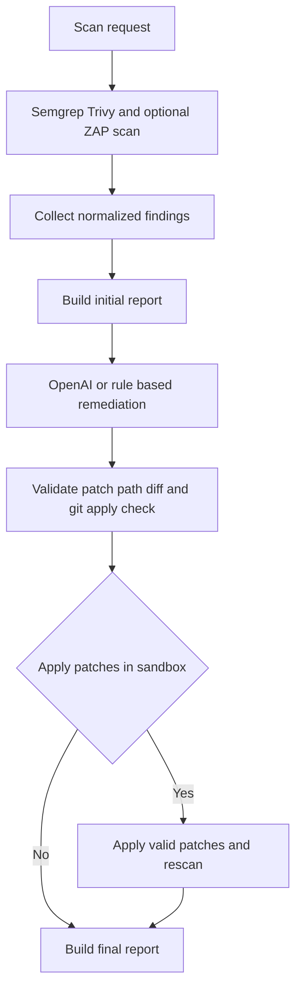
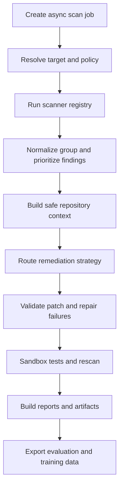

# defAPI

defAPI는 취약한 로컬 코드를 보안 스캐너로 분석하고, 보고서를 만든 뒤, LLM이 패치 후보를 생성하고, sandbox에서 검증한 결과를 반환하는 FastAPI 기반 보안 remediation MVP입니다.

현재 목표 파이프라인은 다음과 같습니다.

```text
사용자 코드
  -> MCP 스캐너 분석(Semgrep, Trivy, ZAP placeholder)
  -> Finding 정규화
  -> 보안 보고서 생성
  -> 취약 코드 context 추출
  -> OpenAI API 또는 rule-based fallback으로 unified diff 생성
  -> path/diff/git apply --check 검증
  -> apply_patches=true이면 sandbox에 패치 적용
  -> MCP 재스캔
  -> 최종 보고서 반환
```

## 워크플로우 개요

### 현재 MVP 워크플로우



### 고도화 목표 워크플로우



상세 분기와 검증 루프는 [워크플로우 문서](docs/WORKFLOW.md)에 정리되어 있습니다.

원본 프로젝트에는 패치를 직접 적용하지 않습니다. 패치 적용 검증은 임시 sandbox에서만 수행합니다.

## 현재 구현 상태

구현됨:

- FastAPI `/health`, `/scan`, `/report/{scan_id}` API
- LangGraph 기반 scan -> report -> remediation -> verification workflow
- Semgrep, Trivy, ZAP MCP wrapper
- Scanner output을 공통 `Finding` 모델로 정규화
- OpenAI API 기반 patch generator
- OpenAI API 키가 없거나 실패할 때 rule-based fallback
- 취약 코드 context 추출 및 LLM prompt 생성
- unified diff 기본 검증
- `git apply --check` 검증
- sandbox patch 적용 후 MCP 재스캔
- LoRA/SFT, DPO 학습 모듈 skeleton

아직 제한적인 부분:

- ZAP은 현재 placeholder이며 기본적으로 skipped 처리됩니다.
- 실제 패치 적용은 원본에 하지 않고 sandbox 검증까지만 합니다.
- 테스트 러너 연동은 아직 없습니다.
- fine-tuned/DPO 모델 inference는 아직 연결 전이며, 그 전까지 OpenAI API를 사용합니다.

## 프로젝트 구조

```text
defapi/
  api.py                  # FastAPI endpoint
  models.py               # Pydantic domain/API model
  workflow.py             # 전체 scan/remediation/verification pipeline
  reports.py              # 최종 report 생성
  patches.py              # rule-based fallback patch 생성
  validation.py           # patch safety + git apply --check 검증
  mcp/
    base.py               # 공통 command scanner wrapper
    semgrep.py            # Semgrep JSON parser
    trivy.py              # Trivy JSON parser
    zap.py                # ZAP placeholder
  remediation/
    context.py            # 취약 코드 주변 context 추출
    prompts.py            # LLM prompt 생성
    model.py              # OpenAI API / fallback remediator
    verifier.py           # sandbox patch 적용 + MCP 재스캔
  training/
    config.py             # fine-tuning 설정
    lora.py               # AdaLoRA/SFT trainer factory
    dpo.py                # DPO trainer factory
    common.py             # training 공통 유틸

scripts/
  train.py                # 학습 entrypoint
```

## 설치

### 1. Python 환경

Python 3.12 기준으로 확인했습니다.

```bash
python -m venv .venv
source .venv/bin/activate
python -m pip install --upgrade pip
```

### 2. Python 의존성

API 실행, OpenAI remediation, Semgrep wrapper, LoRA/SFT/DPO 학습에 필요한 Python 패키지를 한 파일에서 설치합니다.

```bash
pip install -r requirements.txt
```

주의: `requirements.txt`에는 `torch`, `transformers`, `peft`, `trl`, `bitsandbytes` 같은 학습용 패키지도 포함되어 있습니다. 4bit 학습은 단일 NVIDIA GPU/CUDA 환경을 기준으로 합니다. Mac/CPU에서는 `bitsandbytes`나 대형 모델 학습이 정상 동작하지 않을 수 있습니다.

### 3. 보안 스캐너 설치

Semgrep:

```bash
pip install semgrep
```

Trivy macOS:

```bash
brew install trivy
```

Trivy Linux:

```bash
curl -sfL https://raw.githubusercontent.com/aquasecurity/trivy/main/contrib/install.sh | sh -s -- -b /usr/local/bin
```

설치 확인:

```bash
semgrep --version
trivy --version
```

ZAP은 현재 MVP에서 placeholder입니다. `include_zap=true`로 요청해도 skipped 결과가 반환됩니다.

## 환경 변수

`.env`는 git에 올라가지 않도록 `.gitignore`에 포함되어 있습니다. `.env.example`을 참고해서 `.env`를 만드세요.

```bash
cp .env.example .env
```

`.env` 예시:

```env
OPENAI_API_KEY=replace_with_rotated_openai_key
DEFAPI_OPENAI_MODEL=gpt-5.2
DEFAPI_REMEDIATOR=openai
```

OpenAI API를 끄고 rule-based fallback만 쓰려면:

```env
DEFAPI_REMEDIATOR=rule
```

이미 채팅이나 로그에 노출된 API 키는 폐기하고 새 키를 발급해서 사용하세요.

## 실행

### 1. API 서버 실행

```bash
uvicorn defapi.api:app --host 127.0.0.1 --port 8000 --reload
```

헬스 체크:

```bash
curl http://127.0.0.1:8000/health
```

응답:

```json
{"status":"ok"}
```

### 2. 스캔 요청

```bash
curl -X POST http://127.0.0.1:8000/scan \
  -H "Content-Type: application/json" \
  -d '{
    "target": "/path/to/local/project",
    "include_zap": false,
    "apply_patches": false
  }'
```

응답:

```json
{
  "scan_id": "generated-id",
  "status": "completed"
}
```

### 3. 보고서 조회

```bash
curl http://127.0.0.1:8000/report/{scan_id}
```

보고서에는 다음 정보가 들어갑니다.

- scanner 실행 결과
- normalized finding 목록
- OpenAI 또는 fallback이 만든 patch suggestion
- validation 결과
- `apply_patches=true`일 때 sandbox 재스캔 결과
- summary count

### 4. sandbox 검증까지 실행

`apply_patches=true`를 사용하면 생성된 diff를 원본이 아닌 임시 sandbox에 적용하고 MCP 스캐너를 다시 실행합니다.

```bash
curl -X POST http://127.0.0.1:8000/scan \
  -H "Content-Type: application/json" \
  -d '{
    "target": "/path/to/local/project",
    "include_zap": false,
    "apply_patches": true
  }'
```

원본 파일은 변경되지 않습니다.

## Docker 실행

Docker build:

```bash
docker compose build
```

Docker 실행:

```bash
docker compose up
```

다른 터미널에서 확인:

```bash
curl http://127.0.0.1:8000/health
```

현재 Dockerfile은 API 실행과 Trivy 설치를 포함합니다. OpenAI API를 Docker에서 쓰려면 `docker-compose.yml`에 환경 변수를 넘겨야 합니다.

예시:

```yaml
environment:
  DEFAPI_SCAN_ROOT: /workspace
  OPENAI_API_KEY: ${OPENAI_API_KEY}
  DEFAPI_OPENAI_MODEL: gpt-5.2
```

## 학습 실행

SFT/LoRA 학습 데이터는 JSONL 형식이며 각 줄에 `prompt`, `completion` 필드가 있어야 합니다.

예시:

```jsonl
{"prompt":"Fix this vulnerable code:\n...", "completion":"--- a/app.py\n+++ b/app.py\n..."}
```

기본 실행:

```bash
python scripts/train.py \
  --train-path dataset/ft_data.jsonl \
  --test-path dataset/test_data.jsonl \
  --output-dir results \
  --new-model deepseek-coder-1.3b-instruct-adalora-gbsw \
  --batch-size 1 \
  --grad-accum 2 \
  --max-seq-length 1024 \
  --epochs 1
```

W&B 없이 실행:

```bash
python scripts/train.py \
  --train-path dataset/ft_data.jsonl \
  --test-path dataset/test_data.jsonl \
  --report-to none
```

4bit을 끄고 실행:

```bash
python scripts/train.py \
  --train-path dataset/ft_data.jsonl \
  --test-path dataset/test_data.jsonl \
  --report-to none \
  --no-4bit
```

## 검증 명령

문법/import 확인:

```bash
python -m compileall -q defapi scripts
```

테스트 파일이 있을 때:

```bash
python -m pytest -q
```

현재 테스트 디렉터리가 없으면 pytest가 `No files were found in testpaths`로 종료할 수 있습니다.

## API 요약

### `GET /health`

서버 상태 확인.

### `POST /scan`

로컬 파일 또는 디렉터리를 스캔합니다.

요청:

```json
{
  "target": "/path/to/local/project",
  "include_zap": false,
  "apply_patches": false
}
```

### `GET /report/{scan_id}`

스캔 결과 보고서를 조회합니다.

## 안전 원칙

- LLM이 만든 패치는 바로 원본에 적용하지 않습니다.
- 경로가 scan target 밖으로 나가면 validation에서 거부합니다.
- unified diff 형식이 아니면 거부합니다.
- `git apply --check`를 통과해야 valid patch로 인정합니다.
- `apply_patches=true`여도 임시 sandbox에서만 적용합니다.
- 최종 적용은 사용자가 보고서와 diff를 검토한 뒤 직접 결정해야 합니다.

## 빠른 문제 해결

### `semgrep executable is not installed`

```bash
pip install semgrep
```

### `trivy executable is not installed`

macOS:

```bash
brew install trivy
```

Linux:

```bash
curl -sfL https://raw.githubusercontent.com/aquasecurity/trivy/main/contrib/install.sh | sh -s -- -b /usr/local/bin
```

### OpenAI가 호출되지 않고 fallback만 동작함

`.env`의 `OPENAI_API_KEY`가 placeholder인지 확인하세요.

```env
OPENAI_API_KEY=replace_with_rotated_openai_key
```

위 값이면 실제 호출하지 않고 fallback으로 내려갑니다. 새로 발급한 실제 키를 넣어야 합니다.

### 포트 8000이 이미 사용 중

```bash
uvicorn defapi.api:app --host 127.0.0.1 --port 8001 --reload
```
